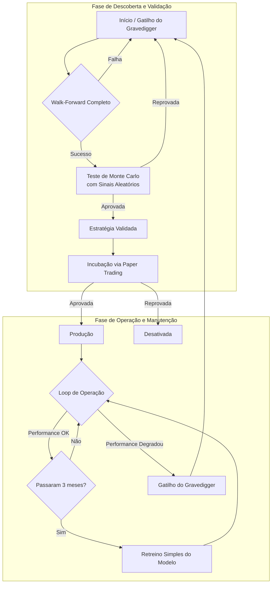
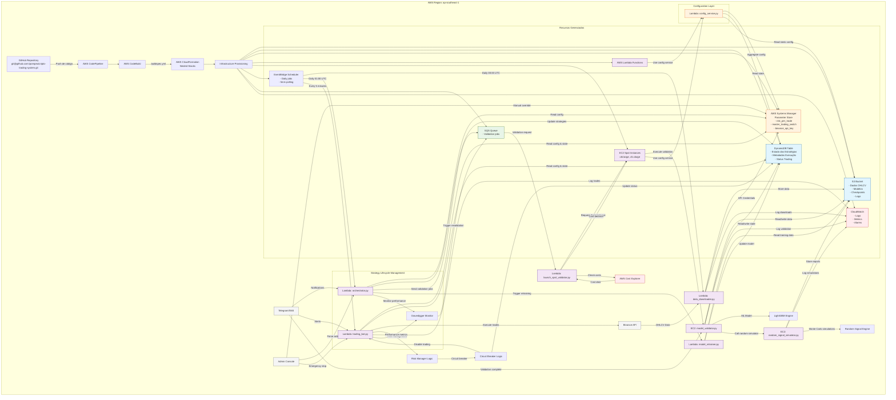
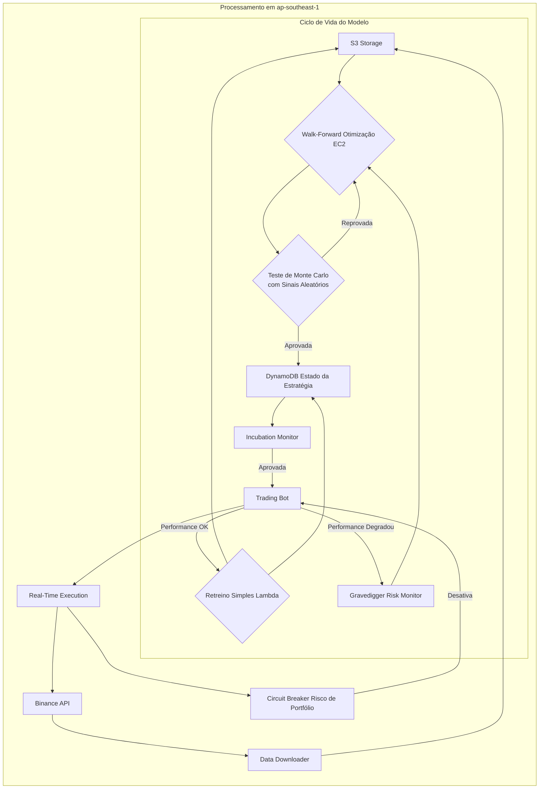

## Prompt de Engenharia

**Título do Projeto:** Sistema de Trading Quantitativo com Implantação Automatizada via CI/CD, Otimização de Parâmetros e Gerenciamento de Risco Avançado
**Versão:** 2.01
**Data:** 20 de agosto de 2025
---
## 1. Resumo Executivo
Este projeto visa construir um sistema de trading algorítmico de ponta a ponta para o mercado de criptomoedas. O objetivo principal é gerar alfa de forma sustentável, com uma filosofia de **sobrevivência de capital** como pilar central. Para isso, utilizaremos um modelo de Machine Learning (**LightGBM**) com parâmetros otimizados através de um rigoroso processo de **Walk-Forward Backtesting**. A solução será implantada na AWS em uma **única região** para maximizar a simplicidade e a custo-efetividade, sendo totalmente gerenciada por um pipeline de CI/CD que automatiza desde a validação do código até a implantação da infraestrutura. Estratégias validadas pelo **Walk-Forward Backtesting** e pelo teste de **Monte Carlo** não avançam diretamente para operação com capital real. Elas devem primeiro passar por um período obrigatório de **incubação via paper trading**, onde seu desempenho é monitorado em tempo real sem risco de capital, assegurando que a robustez teórica se traduza em eficácia prática antes de qualquer alocação de fundos.
### 1.1. Fonte de Inspiração para o desenvolvimento do sistema
-   **Automatização:** Livro **Trabalhe 4 horas por semana, por Timothy Ferriss**
-   **Gerenciamento de risco:** Livros **Trade Your Way to Financial Freedom** e **Super Trader, por Van Tharp**
-   **Walk-Forward Backtesting e Incubação:** Livro **Building Winning Algorithmic Trading Systems, por Kevin Davey**
### 1.2. Validação de Princípios de Van Tharp
-   Teste de Robustez com Entradas Aleatórias: 
  - O sistema incorpora um Módulo de Simulação de Monte Carlo com Sinal Aleatório para validar o princípio fundamental de Van Tharp de que a lucratividade deve emergir primariamente do gerenciamento de risco e saída.
  - Este teste é executado após a validação por Walk-Forward e antes da incubação, garantindo que apenas estratégias cuja expectância positiva seja sustentada mesmo com sinais de entrada aleatórios prossigam para operação real.
---
## 2. Diretiva Principal
##### Atue como um Arquiteto de Soluções de IA, Engenheiro de Software Sênior, Arquiteto de Dados Sênior, Engenheiro de Machine Learning Sênior, Engenheiro DevOps Sênior e Operador Profissional de Criptomoedas. Sua missão é projetar, desenvolver e implantar um sistema de trading quantitativo para o mercado de criptomoedas que seja altamente automatizado, custo-efetivo e resiliente, com um ciclo de vida de software e de modelo totalmente gerenciado, incluindo validação por simulação de Monte Carlo com entradas aleatórias para testar a robustez do gerenciamento de risco.
---
## 3. Pilares Filosóficos e Fundamentais do Projeto
### 3.1. O Core da Solução - A Lógica de Trading
-   **Geração de Alpha com Modelo de Machine Learning:** O sinal de entrada será gerado por um modelo de classificação (**LightGBM**).
-   **Engenharia de Features com Otimização de Parâmetros:** A base para o modelo será derivada dos indicadores **Ichimoku Kinko Hyo, RSI e ATR**. O sistema não usará parâmetros fixos; em vez disso, ele irá **testar um range de períodos para cada indicador**, conforme definido no `config.json`, para descobrir a combinação mais robusta para cada par de ativo/timeframe. Os hiperparâmetros do modelo também serão otimizados conforme definido no `config.json`.
-   **Validação Robusta com Walk-Forward (Conceitos de Kevin Davey):** Cada combinação de parâmetros será submetida a um rigoroso processo de **Walk-Forward Backtesting**.
    -   **O Treinamento do Modelo está Encapsulado no Walk-Forward:** O processo simula a realidade operacional através de um ciclo de **treinar-validar-avançar**. O modelo é treinado em uma janela de dados, validado na janela seguinte, e então todo o processo avança no tempo, com o modelo sendo completamente retreinado para se adaptar a novas condições de mercado.
    -   **Estrutura das Janelas:** 12 meses de treino, 3 meses de validação, 3 meses de passo (definido no `config.json`).
    -   **Ciclo de Vida do Modelo Híbrido (Descoberta vs. Manutenção):** O sistema adota um ciclo de vida de modelo em duas fases para equilibrar robustez e eficiência de custos.
        - Fase de Descoberta (Walk-Forward Completo): Para encontrar novas estratégias, o sistema executa um rigoroso e completo Walk-Forward Backtesting. Este processo de otimização testa todo o range de parâmetros (config.json) para identificar a combinação mais robusta sobre dados históricos. É acionado no início ou quando uma estratégia em produção falha.
        - Fase de Incubação (Paper Trading): Estratégias validadas pelo Walk-Forward e aprovadas no teste de Monte Carlo não são implantadas imediatamente. Elas entram em um período de incubação via paper trading, onde o trading_bot.py simula execuções em tempo real usando os preços de mercado atuais, mas sem emitir ordens reais para a corretora. O desempenho é registrado e avaliado com as mesmas métricas rigorosas (expectância, drawdown) contra os critérios de promoção definidos em config.json. Esta etapa é fundamental para detectar falhas de modelagem não capturadas no backtest, como problemas de liquidez ou slippage, sem arriscar capital.
        - Fase de Manutenção (Retreino Simples): Uma vez que uma estratégia está em produção, ela entra em um loop de retreino eficiente. A cada step_months (3 meses), o modelo é retreinado com a janela de dados mais recente, mas mantendo os mesmos parâmetros de estratégia que o tornaram bem-sucedido. Isso garante que o modelo se adapte às condições de mercado recentes sem o alto custo de uma reotimização completa.
-   **Definição da Variável Alvo (Target):** A variável alvo (`y`) para o modelo de classificação será definida pela **abordagem de Potencial de Tendência**. O objetivo é prever se uma operação atingirá um lucro de **+3R (ou mais)** antes de atingir o stop de perda inicial de **-1R**, identificando a direção da abertura da posição com o target em "compra" (`1`), "venda" (`-1`) ou "neutro" (`0`). **Este alvo está alinhado com a estratégia de saída real e visa capturar movimentos com potencial de continuidade. Para evitar look-ahead bias, a simulação histórica usará apenas dados disponíveis até o momento da operação (t-1).**
- **Análise de Importância de Features com SHAP:** Após o treinamento inicial do modelo na primeira janela de Walk-Forward, será executada uma análise SHAP para identificar as features mais relevantes. Esta análise será armazenada junto aos resultados da validação para:
  - Priorizar features com maior impacto preditivo
  - Identificar dependências temporais (features úteis apenas em regimes específicos)
  - Validar a lógica econômica por trás das decisões do modelo
-   **Estratégia de Saída da Operação:** A gestão da saída será focada em deixar os lucros correrem, que é um conceito dos livros de Van Tharp.
    -   **Stop Loss:**
        - O conceito de "R" (Risco) de Van Tharp é usado como unidade de medida para a gestão da posição
        - Definido com base na volatilidade, posicionado em `[multiplicador volatilidade] * ATR`
        - A fórmula do `[multiplicador volatilidade]` do ATR é `max(<max_multiplier>, min(<min_multiplier>, (ATR_atual / <ATR_médio_histórico>)))`
        - `<max_multiplier>` e `<min_multiplier>` estão configurados no `config.json`
        - `<ATR_médio_histórico>` ATR histórico calculado sobre `<historical_atr_window>` períodos
        - O período do ATR usado na abertura de posição e manutenção da mesma, deve ser o mesmo que o modelo foi treinado
    -   **Take Profit:** Não haverá um alvo de lucro fixo.
    -   **Gerenciamento Ativo:** A posição será gerenciada com uma lógica de múltiplos estágios:
          - **Break-Even Dinâmico:**
              - Acionado quando o lucro atinge um múltiplo do risco inicial (1R = `[multiplicador volatilidade]` * ATR)
          - **Proteção Emergencial por Circuit Breaker:**
              - Ativada quando o drawdown diário ≥ `<breakeven_alert_threshold>`% do limite configurado
              - Força Break-Even imediato em TODAS as posições com qualquer lucro positivo
              - Prioridade sobre outras regras de saída
    -   **Trailing Stop:** Após a posição atingir um lucro de **+2R**, um trailing stop é ativado a uma distância de **`[multiplicador volatilidade]` * ATR** do preço atual.
- **Resiliência com Checkpoints no Walk-Forward**
  - **Mecanismo de Persistência:** O processo de Walk-Forward implementará checkpoints após cada janela de validação concluída, armazenando o estado completo no S3.
  - **Metadados de Progresso:** Será mantido um registro no DynamoDB com o status atual de cada job de validação, incluindo a janela temporal atual e parâmetros testados.
  - **Recuperação Automática:** Em caso de interrupção da instância Spot, o sistema automaticamente retomará a validação do último checkpoint válido quando uma nova instância for provisionada.
  - **Eficiência de Custo:** Os checkpoints minimizam retrabalho e permitem uso mais eficiente de instâncias Spot de menor custo, mesmo com possíveis interrupções.

#### 3.1.4. Resiliência com Checkpoints no Walk-Forward
- O processo computacionalmente intensivo de Walk-Forward Backtesting implementa um sistema robusto de checkpoints para garantir continuidade mesmo com interrupções de instâncias Spot:
    - Persistência de Estado Intermediário: Após cada janela de validação concluída com sucesso, o estado completo do processo é serializado e armazenado no S3, incluindo:
      - Parâmetros testados e seus resultados
      - Modelos treinados na janela atual
      - Métricas de performance calculadas
      - Próxima janela a ser processada
    - Metadados de Execução: Uma entrada no DynamoDB mantém o status atual de cada job de validação, funcionando como ponto de controle para recuperação:
      - Timestamp do último checkpoint
      - Número de janelas concluídas
      - Hash de verificação do checkpoint
      - Status (executando, concluído, falha)
    - Recuperação Automática: Quando uma nova instância Spot é provisionada para um job interrompido:
      - Consulta o DynamoDB para identificar o último checkpoint válido
      - Baixa o estado serializado do S3
      - Retoma execução exatamente do ponto de parada
      - Atualiza metadados continuamente durante a execução
    - Otimização de Custos: Este mecanismo permite:
      - Uso de instâncias Spot com maior probabilidade de interrupção (mais baratas)
      - Execução em horários de menor custo computacional
      - Paralelização de múltiplos jobs de validação com gerenciamento independente
      - Redução de retrabalho computacional em até 100% para jobs interrompidos

#### 3.1.5. Validação de Robustez com Simulação de Monte Carlo e Sinais Aleatórios
- Propósito: Validar o princípio de Van Tharp de que a lucratividade sustentável emerge do gerenciamento de risco (exits) e não da precisão das entradas.
- Execução Pós-Walk-Forward: Este teste é executado automaticamente após a conclusão bem-sucedida do Walk-Forward Backtesting, utilizando os mesmos parâmetros ótimos de saída e risco descobertos, mas substituindo o sinal preditivo do modelo por um gerador aleatório.
- Metodologia:
    - Distribuição de Sinais Baseada no Backtest: O gerador de sinais aleatórios produzirá sequências onde a probabilidade de Compra (1), Venda (-1) e Neutro (0) é proporcional à frequência observada no backtest original daquela janela de validação.
    - Múltiplas Iterações (Monte Carlo): São executadas n_simulations (ex: 1000) simulações independentes sobre todo o período de validação (3 meses).
    - Métricas de Avaliação: Para cada simulação, são calculadas:
        - Expectância (R-multiple esperado)
        - Taxa de Acerto
        - Profit Factor
        - Drawdown Máximo
    - Critério de Aprovação: A estratégia só é considerada robusta e apta para incubação se:
        - >95% das simulações aleatórias apresentarem expectância positiva (expectancy_threshold > 0)
        - A expectância média das simulações for positiva e estatisticamente significante (teste t, p-value < 0.05)
    - Geração de Relatório: Um relatório detalhado com distribuição de resultados, gráficos de curvas de capital e métricas consolidadas é armazenado no S3 junto aos demais artefatos da validação.

### 3.2. Features for Trading Model (Ichimoku, RSI, ATR + Candlestick)
#### 3.2.1. Features do Ichimoku Cloud
| Feature Name | Descrição | Cálculo/Valor |
| :--- | :--- | :--- |
| `price_above_cloud` | Preço está acima da nuvem. | 1 se Preço > max(Senkou A, Senkou B), senão 0 |
| `price_below_cloud` | Preço está abaixo da nuvem. | 1 se Preço < min(Senkou A, Senkou B), senão 0 |
| `price_inside_cloud` | Preço está dentro da nuvem. | 1 se Preço estiver entre Senkou A e B, senão 0 |
| `cloud_green` | Nuvem está verde (altista). | 1 se Senkou A > Senkou B, senão 0 |
| `cloud_thickness` | Espessura normalizada da nuvem. | `(Senkou A - Senkou B) / Preço` |
| `tenkan_kijun_cross` | Cruzamento da Tenkan-sen com a Kijun-sen. | 1 (cruzamento de alta), -1 (cruzamento de baixa), 0 (sem cruzamento) |
| `price_vs_kijun` | Posição do preço em relação à Kijun-sen. | 1 (acima), -1 (abaixo), 0 (próximo) |
| `chikou_position` | Posição da Chikou Span em relação ao preço histórico. | 1 se Chikou > max(high[26p atrás]), -1 se < min(low[26p atrás]), senão 0 |
| `dist_price_to_cloud` | Distância do preço à borda da nuvem, normalizada pelo ATR. | `(Preço - Borda da Nuvem) / ATR` |
| `dist_price_to_kijun` | Distância do preço à Kijun-sen, normalizada pelo ATR. | `(Preço - Kijun-sen) / ATR` |
| `kumo_twist` | Identifica a "torção" da nuvem (cruzamento das Senkou Spans). | 1 se a nuvem mudou de cor no período atual, senão 0 |
#### 3.2.2. Features do RSI (Índice de Força Relativa)
| Feature Name | Descrição | Cálculo/Valor |
| :--- | :--- | :--- |
| `rsi_overbought` | Condição de sobrecompra. | 1 se RSI > 70, senão 0 |
| `rsi_oversold` | Condição de sobrevenda. | 1 se RSI < 30, senão 0 |
| `rsi_bullish_div` | Divergência de alta (preço com fundo mais baixo, RSI com fundo mais alto). | 1 se detectada nos últimos 20 períodos, senão 0 |
| `rsi_bearish_div` | Divergência de baixa (preço com topo mais alto, RSI com topo mais baixo). | 1 se detectada nos últimos 20 períodos, senão 0 |
| `rsi_slope` | Inclinação do RSI. | `(RSI[t] - RSI[t-3]) / 3` |
| `rsi_std` | Volatilidade do RSI. | Desvio padrão do RSI sobre 14 períodos |
| `rsi_midline_rejection` | Rejeição do RSI na linha central de 50. | 1 (rejeição por baixo), -1 (rejeição por cima), 0 (sem rejeição) |
| `rsi_in_momentum_zone` | RSI em zona de forte momentum. | 1 se RSI > 60 (alta), -1 se RSI < 40 (baixa), senão 0 |
| `time_in_extreme_zone` | Períodos consecutivos em zona extrema. | Contagem de períodos com RSI > 70 ou < 30 |
#### 3.2.3. Features do ATR (Average True Range)
| Feature Name | Descrição | Cálculo/Valor |
| :--- | :--- | :--- |
| `atr_pct` | Volatilidade relativa. | `(ATR / Preço) * 100` |
| `atr_expanding` | Volatilidade relativa ao máximo histórico. | `ATR[t] / max(ATR sobre 252 períodos)` |
| `price_atr_ratio` | Amplitude do preço normalizada. | `(High - Low) / ATR` |
| `atr_volume` | Correlação entre ATR e volume. | `Correlação(ATR, Volume, janela=10)` |
| `compression_ratio` | Compressão/expansão da volatilidade. | `ATR(5) / ATR(20)` |
| `atr_regime` | Regime de volatilidade. | 0 (baixa), 1 (normal), 2 (alta) baseado em percentis |
| `atr_breakout` | Aumento súbito e significativo na volatilidade. | 1 se `ATR[t] > (Média(ATR, 20) + 2 * DesvioPadrão(ATR, 20))`, senão 0 |
| `is_low_volatility` | Período de volatilidade extremamente baixa. | 1 se `atr_pct` < 10º percentil histórico, senão 0 |
| `atr_trend` | Tendência da volatilidade (expansão ou contração). | 1 se `SMA(ATR, 5) > SMA(ATR, 20)`, senão 0 |
#### 3.2.4. Features de Candlestick e Volume
| Feature Name | Descrição | Cálculo/Valor |
| :--- | :--- | :--- |
| `body_size_ratio` | Tamanho relativo do corpo. | `abs(Close - Open) / (High - Low)` |
| `upper_shadow_ratio` | Proporção da sombra superior. | `(High - max(Open, Close)) / (High - Low)` |
| `lower_shadow_ratio` | Proporção da sombra inferior. | `(min(Open, Close) - Low) / (High - Low)` |
| `hammer` | Padrão Hammer (reversão de alta). | 1 se `lower_shadow_ratio` > 0.7, `body_size_ratio` < 0.3, e em tendência de baixa, senão 0 |
| `hanging_man` | Padrão Hanging Man (reversão de baixa). | 1 se `upper_shadow_ratio` > 0.7, `body_size_ratio` < 0.3, e em tendência de alta, senão 0 |
| `engulfing_bullish` | Padrão de Engolfo de Alta. | 1 se corpo verde atual engolfa corpo vermelho anterior, senão 0 |
| `piercing_pattern` | Padrão Piercing (Penetrante). | 1 se vela verde fecha acima do meio do corpo vermelho anterior, senão 0 |
| `distance_to_ma` | Distância à média móvel normalizada pelo ATR. | `(Preço - MA(20)) / ATR` |
| `volume_spike` | Pico anormal de volume. | 1 se Volume > 2.5 * Média(Volume, 20), senão 0 |
| `up_trend_strength` | Força da tendência de alta recente. | Percentual de velas verdes nos últimos 5 períodos |
| `consecutive_body_growth` | Crescimento consecutivo do corpo da vela. | Contagem de velas com corpo maior que o anterior |
| `high_volume_reversal` | Reversão com alto volume. | 1 se `volume_spike` e vela de reversão, senão 0 |
| `marubozu` | Vela Marubozu (sem sombras). | 1 (alta), -1 (baixa), 0 (nenhum) |
| `doji` | Vela Doji (indecisão). | 1 se `body_size_ratio` < 0.05, senão 0 |
| `wick_dominance` | Dominância das sombras (pressão de compra/venda). | `upper_shadow_ratio` - `lower_shadow_ratio` |
| `three_white_soldiers` | Padrão Três Soldados Brancos. | 1 se 3 velas verdes longas consecutivas fechando mais alto, senão 0 |
| `three_black_crows` | Padrão Três Corvos Negros. | 1 se 3 velas vermelhas longas consecutivas fechando mais baixo, senão 0 |
#### 3.2.5. Features Combinadas
| Feature Name | Descrição | Cálculo/Valor |
| :--- | :--- | :--- |
| `kumo_support_rsi` | Pullback em tendência de alta (preço acima da nuvem e RSI < 50). | 1 se `price_above_cloud` e RSI < 50, senão 0 |
| `kumo_resistance_rsi` | Rejeição em resistência (preço abaixo da nuvem e RSI > 50). | 1 se `price_below_cloud` e RSI > 50, senão 0 |
| `atr_high_rsi_extreme` | Alta volatilidade com RSI em extremo. | 1 se ATR > Média(ATR,20) e (RSI > 70 ou RSI < 30), senão 0 |
| `kumo_thickness_atr` | Espessura da nuvem relativa à volatilidade. | `cloud_thickness` / `atr_pct` |
| `atr_body_ratio` | Tamanho do corpo da vela relativo à volatilidade. | `abs(Close - Open) / ATR` |
| `oversold_hammer` | Padrão Hammer com RSI em sobrevenda. | 1 se `hammer` e RSI < 30, senão 0 |
| `kumo_breakout_candle` | Breakout da nuvem com confirmação. | 1 se preço fecha fora da nuvem, `body_size_ratio` > 0.7, e Volume > Média(Volume,5), senão 0 |
| `rsi_price_divergence` | Divergência dinâmica RSI-preço. | Correlação entre mudanças de preço e mudanças de RSI em 10 períodos |
| `trend_confirmation` | Confirmação tripla de tendência. | 1 se `price_above_cloud`, `cloud_green` e RSI > 50. -1 para o oposto. |
| `volatility_squeeze_breakout` | Breakout após compressão de volatilidade. | 1 se `is_low_volatility` recente e preço rompe um canal (ex: Bandas de Bollinger). |
| `divergence_in_cloud` | Divergência de RSI ocorrendo dentro da nuvem. | 1 se `price_inside_cloud` e (`rsi_bullish_div` ou `rsi_bearish_div`). |
| `reversal_at_kijun` | Padrão de reversão de candle perto da Kijun-sen. | 1 se `abs(dist_price_to_kijun) < 0.2` e houver um padrão de reversão. |
### 3.3. Gerenciamento de Risco Multinível (Filosofia Central)
A sobrevivência do sistema é o pilar mais importante, alcançada através de múltiplas camadas de gerenciamento de risco:
-   **Nível 1: Risco por Operação (Framework de K. Van Tharp):** Cada operação individual terá seu risco controlado através de **Position Sizing Dinâmico**, arriscando apenas um pequeno percentual configurável (1R) do **capital disponível (capital total - margem utilizada em posições abertas)**, vale ressaltar que o 1R é igual a `[multiplicador volatilidade]` * ATR, que é o risco por trade.
-   **Nível 2: Disjuntor de Risco de Portfólio (Circuit Breaker):** Para proteger contra perdas agregadas, o sistema implementará um disjuntor de risco global. Se o drawdown do portfólio exceder um limite pré-definido (diário, semanal, mensal), o sistema:
    -   **Interromperá todas as novas operações de trading.**
    -   Permanece desativado até que a condição de reset seja atendida.
    - **Reativação Automática:** O sistema reativa o trading automaticamente quando o drawdown cai abaixo de 50% do limite que acionou o disjuntor (ex: se limite diário=5%, reativa em 2.5%).
### 3.4. Automação de DevOps e CI/CD (Implantação Segura)
A automação não se aplica apenas à lógica de trading, mas também ao ciclo de vida do próprio software. O projeto adotará uma abordagem de DevOps completa para garantir implantações seguras, rápidas e consistentes.
-   **Fonte Única da Verdade:** Um repositório no GitHub (git@github.com:tpompeu/cripto-trading-system.git) conterá todo o código da aplicação, a configuração e os templates de infraestrutura.
-   **Pipeline de Integração e Implantação Contínua (CI/CD):** Será implementado um **AWS CodePipeline** para orquestrar todas as mudanças, acionado por cada `merge` na branch principal.
-   **Infraestrutura como Código (IaC) Gerenciada:** Todas as mudanças na infraestrutura serão aplicadas de forma controlada através do pipeline pelo **AWS CloudFormation**, com a possibilidade de um passo de aprovação manual para mudanças críticas.
-   **Rollback Automatizado:** Em caso de falha na validação de um novo modelo, o pipeline reverte para a versão anterior do modelo armazenada no S3 e notifica via SNS.
### 3.5. Escopo dos Dados e Estrutura de Validação
-   **Fonte de Dados:** API da Binance. Os dados serão baixados e mantidos em um repositório centralizado no S3.
-   **Gestão de Credenciais:** As chaves da API da Binance serão armazenadas no **AWS Systems Manager Parameter Store** e acessadas via `config_service`.
-   **Período Histórico Total:** 5 anos (janela deslizante).
-   **Política de Retenção de Dados:** Lifecycle policy no S3 para excluir dados após 5 anos.
-   **Estrutura das Janelas de Walk-Forward:** 12 meses de treino, 3 meses de validação, 3 meses de passo.
### 3.6. Estratégia de Configuração (Estática vs. Dinâmica)
-   **Configuração Estática (`config.json`):** Versionada no Git, define a **arquitetura da estratégia**. Mudanças aqui são estruturais e exigem um novo ciclo de CI/CD para serem aplicadas.

```json
{
  "asset_timeframes": {
    "BTCUSDT": ["1h"]
  },
  "indicator_parameters": {
    "ichimoku": {
      "tenkan_sen": {"start": 8, "end": 10, "step": 1},
      "kijun_sen": {"start": 24, "end": 28, "step": 2},
      "senkou_span_b": {"start": 48, "end": 56, "step": 4}
    },
    "rsi": {
      "period": {"start": 7, "end": 28, "step": 7}
    },
    "atr": {
      "period": {"start": 7, "end": 28, "step": 7}
    }
  },
  "model_hyperparameters": {
    "LightGBM": {
      "learning_rate": {"type": "float", "min": 0.01, "max": 0.3, "log": true},
      "num_leaves": {"type": "int", "min": 20, "max": 100},
      "min_data_in_leaf": {"type": "int", "min": 10, "max": 50},
      "n_estimators": {"type": "int", "min": 50, "max": 500}
    }
  },
  "walk_forward_config": {
    "training_months": 12,
    "validation_months": 3,
    "step_months": 3
  },
  "incubation_promotion": {
    "expectancy_threshold": 0.01,
    "min_trades": 10,
    "period": "last_30_trades"
  },
  "production_promotion": {
    "minimum_duration_months": 1,
    "expectancy_threshold": 0.01,
    "min_trades": 10,
    "period": "last_30_trades"
  },
  "gravedigger": {
    "minimum_duration_months": 3,
    "min_trades": 10,
    "expectancy_threshold": 0.0
  },
  "circuit_breaker": {
    "daily": 0.05,
    "weekly": 0.10,
    "monthly": 0.15,
    "auto_reset_threshold": 0.5,
    "breakeven_alert_threshold": 0.5
  },
  "break_even": {
    "min_multiplier": 1.0,
    "max_multiplier": 1.5,
    "historical_atr_window": 252
  },
    "checkpoint_config": {
    "checkpoint_interval": "after_each_validation_window",
    "s3_checkpoint_path": "s3://[BUCKET_NAME]/walk_forward_checkpoints/",
    "max_resume_attempts": 3,
    "checkpoint_retention_days": 30
  },
  "monte_carlo_config": {
    "n_simulations": 1000,
    "confidence_level": 0.95,
    "p_value_threshold": 0.05,
    "random_seed": 42
  },
}
```
-   **Configuração Dinâmica (AWS Systems Manager Parameter Store):** Externalizada para funcionar como **alavancas operacionais**, permitindo ajustes em tempo real sem a necessidade de um novo deploy. Os parâmetros serão criados no Parameter Store com os seguintes nomes e valores padrão:

| Parâmetro (Nome no Parameter Store) | Tipo      | Valor Padrão (Default)                                                                                             | Validação | Propósito                                                          |
| :---------------------------------- | :-------- | :----------------------------------------------------------------------------------------------------------------- | :-------- | :----------------------------------------------------------------- |
| `/trading_system/risk/risk_per_trade` | `Float`   | `0.01`                                                                                                             | 0.001 ≤ valor ≤ 0.05 | Percentual do capital a ser arriscado por operação (1%).            |
| `/trading_system/risk/risk_exposition` | `Float`   | `0.03`                                                                                                             | 0.001 ≤ valor ≤ 0.05 | Percentual do capital a ser arriscado para exposição em multiplas posições (3%), se os riscos das posições somandas superar esse valor, nenhuma posição será aberta.            |
| `/trading_system/ops/master_trading_switch` | `Boolean` | `true`                                                                                                             | - | Interruptor mestre para habilitar/desabilitar o trading.           |
| `/trading_system/cost/spot_min_discount_perc` | `Float`  | `0.95`                                                                                                           | - | Percentual mínimo de desconto na instância Spot  |
| `/trading_system/cost/monthly_cost_limit` | `Float`  | `10.0`                                                                                                           | - | Custo máximo mensal |
| `/trading_system/cost/spot_instance_type` | `String`  | `['c6i.large', 'c5.xlarge', 'c6a.2xlarge', 'm6i.large', 'm5.xlarge']`  | - | Lista de instância Spot  |
| `/trading_system/environment/github_repo` | `String`  | `git@github.com:tpompeu/cripto-trading-system.git`                                                                                                           | - | Repositório do GitHub  |
| `/trading_system/environment/binance_api_key` | `String`  | ``                                                                                                           | - | Binance Api Key  |

-   **Camada de Configuração Unificada:** Implementação de um serviço `config_service` que agrega:
    - Parâmetros do AWS Systems Manager (SSM )
    - Estados do DynamoDB
    - Configuração estática do S3
    - Proporciona interface única para acesso a configurações

### 3.7. Arquitetura Simplificada e Otimização de Custos
-   **Região Única:** Para maximizar a simplicidade e reduzir a complexidade de gerenciamento, **toda a infraestrutura será implantada em uma única região da AWS: `ap-southeast-1` (Singapore)**. Esta abordagem elimina a necessidade de replicação de dados entre regiões e simplifica a arquitetura de rede.
-   **Estratégia de Custos:**
    -   A validação em lote (Walk-Forward) será executada em **Instâncias Spot EC2** para uma economia de custos de no mínimo 95%.
    -   As tarefas de orquestração e execução de trades usarão **AWS Lambda**, pagando apenas pelo tempo de computação utilizado, o que é ideal para processos curtos e agendados.
    -   O uso de uma fila **SQS** para desacoplar a solicitação de validação da execução permite um sistema resiliente que pode tentar a alocação da Instância Spot de forma inteligente.
-   **Mecanismo de Controle de Custo Mensal:** 
    -   O provisionamento de novas instâncias Spot será condicionado ao custo mensal acumulado do projeto. 
    -   A Lambda launch_spot_validator.py consultará o AWS Cost Explorer e, se o custo atual somado a uma estimativa do custo da nova instância exceder o limite definido em /trading_system/cost/monthly_cost_limit (padrão $10), o provisionamento será impedido. 
    -   As tarefas de orquestração e execução de trades usarão AWS Lambda, pagando apenas pelo tempo de computação utilizado, o que é ideal para processos curtos e agendados.
    -   O uso de uma fila SQS para desacoplar a solicitação de validação da execução permite um sistema resiliente que pode tentar a alocação da Instância Spot de forma inteligente.
    -   Tags de Alocação de Custos: Todos os recursos da AWS relacionados ao projeto serão tagueados com Project: CryptoTradingSystem para permitir um monitoramento preciso dos custos via AWS Cost Explorer e Budgets.

---
## 4. Especificações Técnicas Detalhadas
### 4.1. Arquitetura de Nuvem e DevOps (AWS)
-   **Infraestrutura como Código Componentizada (IaC):** Para garantir manutenibilidade e segurança, a infraestrutura **será dividida em múltiplos templates do CloudFormation**, representando pilhas de recursos lógicos (ex: `iam.yaml`, `storage.yaml`, `processing.yaml`).
    -   **Pilhas Aninhadas (Nested Stacks):** Um template raiz (`main.yaml`) orquestrará a implantação das pilhas filhas na ordem correta de dependência, limitando o "raio de explosão" de qualquer mudança.
    - **Gestão de Credenciais:** Uso do AWS Systems Manager Parameter Store para armazenar chaves da Binance.
    - **Política de Retenção de Dados:** Lifecycle policy no S3 para excluir dados após 5 anos.
-   **Pipeline de CI/CD Granular:** O **AWS CodePipeline** será projetado para implantar essas pilhas de forma independente, tornando as atualizações mais rápidas e seguras.
-   **Parâmetros de Configuração Dinâmica:** Os parâmetros no **AWS Systems Manager Parameter Store** também serão provisionados via IaC, garantindo que sua existência seja gerenciada, mas seus valores possam ser alterados dinamicamente.
-   **Build Specification (`buildspec.yml`):** Um arquivo no repositório que define os comandos a serem executados no estágio de build.
-   **Segurança e Permissões (IAM):** 
    - As roles do IAM devem seguir o **princípio do menor privilégio**. 
    - Cada Lambda e a instância EC2 terão sua própria role com permissões estritamente necessárias para suas tarefas (ex: a Lambda `trading_bot` não terá permissão para deletar a tabela DynamoDB).
    - A role da Lambda launch_spot_validator.py terá permissões para consultar o AWS Cost Explorer (ce:GetCostAndUsage).
-   **Serviço de Configuração Unificada:** Implementação do `config_service` como Lambda.
-   **Gerenciamento de Dependências Lambda** Para garantir que as dependências do projeto (como `pandas` e `lightgbm`) não excedam o limite de 250 MB da AWS Lambda, será criada **uma única e otimizada layer**.
    -   **Layer Única:** Todas as funções Lambda compartilharão a mesma layer, simplificando o gerenciamento.
    -   **Otimização no Build:** Durante o processo de CI/CD, um passo automatizado irá remover arquivos desnecessários (testes, caches, metadados) das bibliotecas instaladas antes de compactar a layer. Esta otimização é suficiente para manter o pacote bem abaixo do limite, evitando a complexidade de múltiplas layers ou do Amazon EFS.

### 4.2. Pipeline de Dados e Modelo (Python - Modular e Resiliente)
#### 4.2.1. Visão Geral do Ciclo de Vida da Estratégia

"Incubação via Paper Trading: Fase intermediária e obrigatória onde a estratégia opera em um ambiente de simulação de tempo real, utilizando a lógica completa de trading e gerenciamento de risco, mas sem executar ordens reais. A promoção para produção só ocorre se o desempenho em paper trading confirmar a expectância positiva observada no backtest."
#### 4.2.2. Scripts Modulares e Fluxo de Trabalho
-   `data_downloader.py` (Lambda): Acionado diariamente para baixar e atualizar os dados históricos no S3.
-   `orchestrator.py` (Lambda): O cérebro do sistema, acionado diariamente para:
    -   Monitorar a performance das estratégias em produção e acionar o Gravedigger se necessário.
    -   Promover estratégias da Incubação.
    -   Verificar se é hora de um retreino simples e acionar o model_retrainer.py.
    -   Enfileirar jobs de validação completa (Walk-Forward) na SQS quando acionado pelo Gravedigger.
-   `initiate_validation_window.py` (Lambda): Acionado para iniciar a janela de oportunidade de alocação de Instâncias Spot.
-   `launch_spot_validator.py` (Lambda): Acionado por mensagens na SQS, tenta requisitar a Instância Spot.
-   `model_validator.py` (Executado na EC2 Spot): Responsável pela Fase de Descoberta. Executa o ciclo completo de Walk-Forward com otimização de parâmetros, implementando checkpoints após cada janela de validação concluída e gerando novas estratégias candidatas. Chama o `random_signal_simulator.py` automaticamente após a conclusão bem-sucedida do Walk-Forward.
-   `model_retrainer.py` (Lambda): Responsável pela Fase de Manutenção. Executa o retreino simples de um modelo existente com dados atualizados, sem reotimizar parâmetros. É uma função mais leve e rápida que a de validação.
-   `random_signal_simulator.py` (Executado na EC2 Spot): Executa a simulação de Monte Carlo com sinais aleatórios utilizando os parâmetros ótimos de saída/risco encontrados no Walk-Forward. Armazena resultados no S3 e atualiza status no DynamoDB.
-   `config_service.py` (Lambda): Classe auxiliar para unificar o acesso a todas as configurações.
-   `trading_bot.py` (Lambda): Executa a lógica central de trading, envia ordem e gerencia posições abertas (Break-Even, Trailling Stop etc...). Possui dois modos operacionais distintos:
    -   Modo Paper Trading (Incubação): Calcula sinais, gerencia risco virtual e simula execuções, registrando o desempenho no DynamoDB sem enviar ordens para a corretora.
    -   Modo Produção: Envia ordens reais para a API da Binance.

#### 4.2.3. Análise de Importância de Features com SHAP
- **Execução Eficiente:** Realizada apenas na primeira janela de treinamento para economizar custos.
- **Métricas Armazenadas:** Top 10 features e valores SHAP completos são salvos no S3.
- **Integração com Ciclo de Vida:** Estratégias com features de alta importância recebem prioridade na promoção.

---
## 5. Entregáveis Finais
| Categoria | Artefato | Descrição |
| :--- | :--- | :--- |
| **1. Infraestrutura e DevOps** | Diretório `/infrastructure` | Contém os múltiplos arquivos de template do CloudFormation. |
| | `buildspec.yml` | Arquivo de especificação para o AWS CodeBuild. |
| | `user_data.sh` | Script de shell para configurar a instância EC2 Spot. |
| **2. Lógica da Aplicação** | Diretório `/src` | Contém todos os scripts Python modulares. |
| | `config.json` | Arquivo de configuração estática da estratégia. |
| | `requirements.txt` | Lista de dependências Python. |
| **3. Documentação** | `README.md` | Documentação completa com diagramas e explicações. |
| | `ARCHITECTURE.md` | Detalhamento da arquitetura e gestão de risco. |
| | `INSTALL_GUIDE.md` | Guia de implementação passo a passo para MacOS apenas. |
---
## 6. Fluxo de Trabalho e Arquitetura

### 6.1. Visão Geral do Sistema Simplificado

### 6.2. Fluxo Operacional Principal Simplificado
